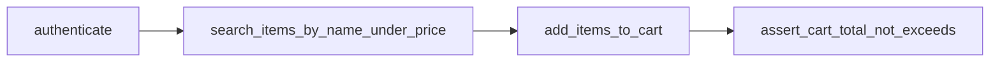

# eBay E2E Automation Framework

> **Repository:** https://github.com/ChaimCymerman0548492309/Ness

פרויקט אוטומציה **E2E** לאתר מסחר (eBay) ב-**Python + Playwright**, עם ארכיטקטורה נקייה:

- **Page Object Model (POM)**
- **OOP / SRP** — הפרדה בין Pages, Services ו-Utils
- **Data-Driven** — תרחישי בדיקה מקובץ JSON / YAML חיצוני
- **דוחות** — Allure + HTML + JUnit XML

> **מסמכי עזר:** [ארכיטקטורה](docs/ARCHITECTURE.md) | [בדיקת עמידה בדרישות](docs/REQUIREMENTS_COMPLIANCE.md) | [ניתוח באגי AI](ReadMeAIBugs.md)

---

## דרישות מקדימות

| דרישה | גרסה |
|--------|-------|
| Python | 3.11+ |
| pip | latest |
| Chromium | מותקן ע"י Playwright |
| Allure CLI (אופציונלי) | לצפייה בדוח Allure |

---

## התקנה

```bash
# יצירת סביבה וירטואלית (מומלץ)
python -m venv .venv
source .venv/bin/activate   # Windows: .venv\Scripts\activate

# התקנת תלויות
pip install -r requirements.txt

# התקנת דפדפן Chromium
playwright install chromium

# (אופציונלי) הגדרות סביבה
cp config/env.example .env
```

---

## הרצת בדיקות

```bash
# כל הבדיקות שאינן תלויות באתר חי (ברירת מחדל)
pytest

# רק smoke שאינו תלוי באתר חי
pytest -m smoke

# הרצה מפורשת מול eBay חי
pytest --run-live-ebay

# תרחיש data-driven מלא (JSON)
pytest --run-live-ebay -m "e2e and data_driven" -k "not yaml"

# תרחיש data-driven מ-YAML
pytest --run-live-ebay tests/test_ebay_e2e.py::test_full_e2e_from_yaml

# עם פרופיל dev (דפדפן גלוי)
ENV_PROFILE=dev pytest --run-live-ebay -m smoke

# CI (headless)
ENV_PROFILE=ci pytest
```

### דוחות

| סוג דוח | נתיב | פקודה |
|---------|------|--------|
| **Allure** | `reports/allure-results/` | `allure serve reports/allure-results` |
| **HTML** | `reports/pytest-report.html` | נוצר אוטומטית בכל `pytest` |
| **JUnit XML** | `reports/junit.xml` | נוצר אוטומטית בכל `pytest` |
| **Screenshots** | `reports/screenshots/` | נוצר בזמן `add_items_to_cart` |
| **Traces** | `reports/traces/` | נוצר בזמן `assert_cart_total_not_exceeds` |

---

## ארכיטקטורה

```
├── config/
│   ├── settings.yaml          # קונפיגורציה + פרופילים (dev/ci/staging)
│   └── env.example            # משתני סביבה
├── data/
│   ├── test_scenarios.json    # Data-Driven (JSON)
│   └── test_scenarios.yaml    # Data-Driven (YAML)
├── pages/                     # Page Object Model
│   ├── base_page.py
│   ├── login_page.py
│   ├── search_page.py
│   ├── product_page.py
│   └── cart_page.py
├── services/                  # Business logic (4 פונקציות מרכזיות)
│   ├── auth_service.py        # authenticate()
│   ├── search_service.py      # search_items_by_name_under_price()
│   ├── cart_service.py        # add_items_to_cart()
│   └── cart_assertion_service.py  # assert_cart_total_not_exceeds()
├── utils/
│   ├── config_loader.py
│   ├── data_loader.py
│   ├── price_parser.py
│   └── screenshot_helper.py
├── tests/
│   └── test_ebay_e2e.py
├── docs/
│   ├── ARCHITECTURE.md
│   └── REQUIREMENTS_COMPLIANCE.md
├── ebay_automation.py         # Facade API
├── resources/
│   └── buggy_ai_test.py
├── conftest.py
├── pytest.ini
└── requirements.txt
```

פירוט מלא: [docs/ARCHITECTURE.md](docs/ARCHITECTURE.md)

### זרימת תרחיש מלא



```python
from ebay_automation import EbayAutomation

automation = EbayAutomation(page)
automation.authenticate()
urls = automation.search_items_by_name_under_price("shoes", 220, 5)
automation.add_items_to_cart(urls)
automation.assert_cart_total_not_exceeds(220, len(urls))
```

---

## 4 הפונקציות המרכזיות

| פונקציה | מיקום | תיאור |
|---------|--------|--------|
| `authenticate()` | `AuthService` | התחברות או Guest stub |
| `search_items_by_name_under_price()` | `SearchService` | חיפוש, פילטר מחיר, XPath, paging |
| `add_items_to_cart()` | `CartService` | הוספה לסל + screenshots |
| `assert_cart_total_not_exceeds()` | `CartAssertionService` | אימות תקציב + trace |

כל פונקציה מתועדת בהערת שורה אחת באנגלית בקוד המקור.

---

## Data-Driven

### JSON — `data/test_scenarios.json`

```json
{
  "id": "shoes_under_budget",
  "query": "shoes",
  "max_price": 220,
  "limit": 5,
  "budget_per_item": 220,
  "enabled": true
}
```

### YAML — `data/test_scenarios.yaml`

```yaml
scenarios:
  - id: shoes_under_budget
    query: shoes
    max_price: 220
    limit: 5
    budget_per_item: 220
    enabled: true
```

בדיקות עם `@pytest.mark.parametrize` טוענות רק תרחישים עם `"enabled": true`.

---

## מגבלות והנחות

| נושא | הנחה |
|------|------|
| **התחברות** | Guest mode כברירת מחדל; ניתן להגדיר `EBAY_USERNAME` / `EBAY_PASSWORD` ב-`.env` |
| **מטבע** | USD (eBay.com) |
| **אתר** | בדיקות מול eBay מסומנות `live_ebay` ומדלגות כברירת מחדל; להרצה חיה השתמשו ב-`--run-live-ebay` או `RUN_LIVE_EBAY=1` |
| **סל** | חלק מהפריטים דורשים התחברות או לא ניתנים להוספה — הבדיקה עלולה להידלג (`pytest.skip`) |
| **מחירים** | מחירים מוצגים בפורמטים שונים (טווחים, מבצעים) — `PriceParser` מטפל בנפוצים |

---

## תרגיל באגי AI

ראה **[ReadMeAIBugs.md](./ReadMeAIBugs.md)** — ניתוח סטטי של `resources/buggy_ai_test.py` עם 7 בעיות מזוהות ותיקונים מוצעים.

---

## עמידה בדרישות המטלה

טבלת מיפוי מלאה: **[docs/REQUIREMENTS_COMPLIANCE.md](docs/REQUIREMENTS_COMPLIANCE.md)**

| קריטריון | משקל | מימוש |
|----------|------|--------|
| POM / OOP / SRP / Utils | 45% | `pages/`, `services/`, `utils/` |
| Robustness & Smart Locators | 35% | XPath, pagination, variants, `PriceParser` |
| Data-Driven / ENV / Profiles | 15% | JSON + YAML, `settings.yaml`, `.env` |
| דוחות / תיעוד | 15% | Allure, HTML, JUnit, README, docs |

---

## רישיון

פרויקט לימודי / תרגיל בדיקות תוכנה.
