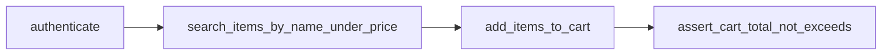

# eBay E2E Automation Framework

Python + Playwright automation project for an e-commerce flow inspired by eBay.

The project demonstrates:

- Page Object Model (POM)
- Object-oriented design and clear separation of responsibilities
- Data-driven tests from JSON and YAML files
- HTML, JUnit, and Allure reports

Supporting documents:

- [Architecture](docs/ARCHITECTURE.md)
- [Requirements compliance](docs/REQUIREMENTS_COMPLIANCE.md)
- [Static review exercise](ReadMeAIBugs.md)

---

## Requirements

| Tool | Version |
|------|---------|
| Python | 3.11+ |
| pip | latest |
| Chromium | installed by Playwright |
| Allure CLI | optional, only for viewing Allure reports |

---

## Setup

```bash
python -m venv .venv
source .venv/bin/activate   # Windows: .venv\Scripts\activate

pip install -r requirements.txt
playwright install chromium

# Optional local environment file
cp config/env.example .env
```

---

## Run Tests

```bash
# Stable default run
pytest

# Full deterministic E2E flow for report submission
pytest -m mock_store

# Fast local smoke tests
pytest -m smoke

# Optional run against the live eBay website
pytest --run-live-ebay

# Live data-driven scenarios from JSON
pytest --run-live-ebay -m "e2e and data_driven" -k "not yaml"

# Live data-driven scenario from YAML
pytest --run-live-ebay tests/test_ebay_e2e.py::test_full_e2e_from_yaml

# Visible browser for local debugging
ENV_PROFILE=dev HEADLESS=false pytest --run-live-ebay -m smoke

# CI/headless profile
ENV_PROFILE=ci pytest
```

Recommended command for the final report:

```bash
pytest -v -m mock_store
```

This command runs the complete search -> add to cart -> cart total assertion flow through the same page objects and services, without depending on a public website that may block automation.

### Watch the E2E Test Run in a Visible Browser

To see the deterministic E2E flow running in real time, run the mock-store test with a visible browser:

```powershell
$env:HEADLESS="false"
python -m pytest -v -m mock_store
```

To make the browser actions easier to follow, use the dev profile:

```powershell
$env:HEADLESS="false"
$env:ENV_PROFILE="dev"
python -m pytest -v -m mock_store
```

During the run you will see Chromium open and perform the same flow that is validated in the report:

1. Open the store home page in guest mode.
2. Navigate to the search results page for `shoes`.
3. Apply the price range.
4. Collect matching product URLs from the first page.
5. Click `Next` and continue collecting until 5 matching products are found.
6. Open each product page.
7. Select a product variant, such as size `M` or `L`.
8. Click `Add to cart`.
9. Return to the search context and continue with the next product.
10. Open the cart page.
11. Read the cart total.
12. Assert that the total does not exceed `budget_per_item * items_count`.

After the demo, you can switch back to headless mode:

```powershell
$env:HEADLESS="true"
$env:ENV_PROFILE="ci"
```

---

## Reports

| Report | Path | Notes |
|--------|------|-------|
| Allure results | `reports/allure-results/` | Generated by pytest |
| HTML report | `reports/pytest-report.html` | Generated by pytest-html |
| JUnit XML | `reports/junit.xml` | Generated by pytest |
| Screenshots | `reports/screenshots/` | Captured after cart actions |
| Traces | `reports/traces/` | Captured during cart total assertion |

To view Allure locally:

```bash
allure serve reports/allure-results
```

---

## Project Structure

```text
├── config/
│   ├── settings.yaml
│   └── env.example
├── data/
│   ├── test_scenarios.json
│   └── test_scenarios.yaml
├── pages/
│   ├── base_page.py
│   ├── login_page.py
│   ├── search_page.py
│   ├── product_page.py
│   └── cart_page.py
├── services/
│   ├── auth_service.py
│   ├── search_service.py
│   ├── cart_service.py
│   └── cart_assertion_service.py
├── utils/
│   ├── config_loader.py
│   ├── data_loader.py
│   ├── price_parser.py
│   └── screenshot_helper.py
├── tests/
│   ├── test_ebay_e2e.py
│   └── test_mock_store_e2e.py
├── docs/
│   ├── ARCHITECTURE.md
│   └── REQUIREMENTS_COMPLIANCE.md
├── resources/
│   └── buggy_ai_test.py
├── ebay_automation.py
├── conftest.py
├── pytest.ini
└── requirements.txt
```

---

## Architecture

The code uses a layered POM structure:

```text
Tests -> Facade -> Services -> Pages -> Utils
```

- `tests/` define the scenarios and assertions.
- `ebay_automation.py` exposes the high-level workflow API.
- `services/` contain business workflow logic.
- `pages/` contain locators and browser interactions.
- `utils/` contain reusable helpers for config, data, parsing, and reports.

---

## Main Flow



Example:

```python
from ebay_automation import EbayAutomation

automation = EbayAutomation(page)
automation.authenticate()
urls = automation.search_items_by_name_under_price("shoes", 220, 5)
added_count = automation.add_items_to_cart(urls)
automation.assert_cart_total_not_exceeds(220, added_count)
```

---

## Core Functions

| Function | Location | Purpose |
|----------|----------|---------|
| `authenticate()` | `AuthService` | Login flow or guest mode |
| `search_items_by_name_under_price()` | `SearchService` | Search, price filter, XPath collection, paging |
| `add_items_to_cart()` | `CartService` | Open product pages, select variants, add items, save screenshots |
| `assert_cart_total_not_exceeds()` | `CartAssertionService` | Open cart, read total, assert budget, save screenshot and trace |

---

## Data Driven Tests

Test scenarios are stored outside the code:

- `data/test_scenarios.json`
- `data/test_scenarios.yaml`

Example scenario:

```json
{
  "id": "shoes_under_budget",
  "query": "shoes",
  "max_price": 220,
  "limit": 5,
  "budget_per_item": 220,
  "enabled": true
}
```

Only scenarios with `enabled: true` are loaded by the parameterized tests.

---

## Assumptions and Limitations

| Area | Notes |
|------|-------|
| Authentication | Guest mode is the default. Credentials can be provided with `EBAY_USERNAME` and `EBAY_PASSWORD`. |
| Currency | USD is assumed. |
| Live website | Public eBay pages may show CAPTCHA, block automation, or change selectors. Live tests are opt-in with `--run-live-ebay`. |
| Stable report | `mock_store` runs the complete required flow through the same POM and services for reliable reporting. |
| Cart behavior | Some live items cannot be added to cart. The code records this and continues safely. |
| Prices | `PriceParser` handles common currency formats and thousands separators. |

---

## Requirement Mapping

See [docs/REQUIREMENTS_COMPLIANCE.md](docs/REQUIREMENTS_COMPLIANCE.md).

| Criterion | Implementation |
|-----------|----------------|
| POM / OOP / SRP / Utils | `pages/`, `services/`, `utils/`, `ebay_automation.py` |
| Robust locators and dynamic behavior | XPath, fallback selectors, pagination, variants, `PriceParser` |
| Data Driven / ENV / Profiles | JSON, YAML, `settings.yaml`, `.env` |
| Reports and documentation | Allure, HTML, JUnit, README, docs |

---

## License

Educational automation project.
