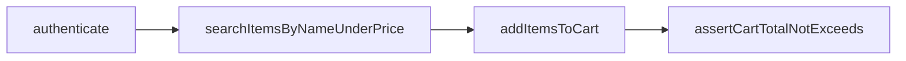

# eBay E2E Automation Framework

Python + Playwright automation for an e-commerce flow inspired by eBay.

**Four core functions (exact brief names):**

- `authenticate` — הזדהות (Guest stub / optional login)
- `searchItemsByNameUnderPrice`
- `addItemsToCart`
- `assertCartTotalNotExceeds`

Supporting docs:

- [Architecture](docs/ARCHITECTURE.md)
- [Requirements compliance](docs/REQUIREMENTS_COMPLIANCE.md)
- [Static AI review](ReadMeAIBugs.md)

---

## Prerequisites

| Tool | Version / notes |
|------|-----------------|
| Python | 3.11+ |
| pip | latest |
| venv | recommended |
| Chromium | installed via Playwright |
| Allure CLI | optional — only to open Allure UI |

---

## How to run

### 1. Setup (one time)

```powershell
python -m venv .venv
.\.venv\Scripts\activate

pip install -r requirements.txt
playwright install chromium

copy config\env.example .env
```

Linux / macOS:

```bash
python -m venv .venv
source .venv/bin/activate
pip install -r requirements.txt
playwright install chromium
cp config/env.example .env
```

### 2. Recommended run (stable report / submission)

```powershell
python -m pytest -v -m mock_store
```

This runs the full required flow on deterministic mock pages through the same POM and services:

`authenticate` → `searchItemsByNameUnderPrice` → `addItemsToCart` → `assertCartTotalNotExceeds`

### 3. Other useful commands

```powershell
# All default tests
python -m pytest

# Smoke only
python -m pytest -m smoke

# Headless CI profile
$env:ENV_PROFILE="ci"
python -m pytest -v -m mock_store

# Visible browser demo
$env:ENV_PROFILE="demo"
$env:HEADLESS="false"
python -m pytest -v -m mock_store

# Optional live eBay (may hit CAPTCHA / blocks)
python -m pytest --run-live-ebay
```

---

## Architecture (short)

Layered Page Object Model:

```text
Tests  →  EbayAutomation (Facade)  →  Services  →  Pages  →  Utils
```

| Layer | Responsibility |
|-------|----------------|
| `tests/` | Scenarios and high-level assertions |
| `ebay_automation.py` | Public API with the four brief function names |
| `services/` | Business workflow (search, cart, assert) |
| `pages/` | Locators and browser actions only (POM) |
| `utils/` | Config, data loading, price parsing, screenshots |
| `data/` | Data-driven JSON / YAML scenarios |
| `config/` | Profiles (`dev` / `demo` / `ci`) and ENV |



Example (module-level functions — same names as the brief):

```python
from ebay_automation import (
    authenticate,
    searchItemsByNameUnderPrice,
    addItemsToCart,
    assertCartTotalNotExceeds,
)

authenticate(page)
urls = searchItemsByNameUnderPrice(page, "shoes", 220, 5)
addItemsToCart(page, urls)
assertCartTotalNotExceeds(page, 220, len(urls))
```

Or via the facade class:

```python
from ebay_automation import EbayAutomation

automation = EbayAutomation(page)
automation.authenticate()
urls = automation.searchItemsByNameUnderPrice("shoes", 220, 5)
automation.addItemsToCart(urls)
automation.assertCartTotalNotExceeds(220, len(urls))
```

More detail: [docs/ARCHITECTURE.md](docs/ARCHITECTURE.md)

---

## Assumptions and limitations

| Area | Assumption / limitation |
|------|-------------------------|
| Authentication | **Guest / Login stub by default** (`cart.guest_mode: true`). No real credentials required. Optional real login via `EBAY_USERNAME` / `EBAY_PASSWORD` in `.env`. |
| Currency | **USD** is assumed for parsing and budget checks. |
| Price comparison | Items with price **<= maxPrice** are accepted. |
| Live eBay | Public site may show CAPTCHA, throttle, or change selectors. Live runs are **opt-in**: `--run-live-ebay`. |
| Stable submission report | Use `pytest -m mock_store` — same APIs/POM, deterministic HTML store. |
| Cart on live | Some live products cannot be added; failures are recorded. On mock store the full cart path is reliable. |
| Paging | If fewer than `limit` items are on the page, the code clicks **Next** until `limit` is reached or pages end. Returning fewer than `limit` (including **0**) is valid. |

---

## Reports (Allure / HTML / JUnit XML)

Every `pytest` run writes reports automatically (`pytest.ini`):

| Report | Path | Tool |
|--------|------|------|
| **Allure** | `reports/allure-results/` | `allure-pytest` |
| **HTML** | `reports/pytest-report.html` | `pytest-html` |
| **JUnit XML** | `reports/junit.xml` | pytest `--junitxml` |
| Screenshots | `reports/screenshots/` | per item + cart assert |
| Traces | `reports/traces/` | cart assertion Playwright trace |

### View reports

```powershell
# HTML — open in browser
start reports\pytest-report.html

# Allure UI (requires Allure CLI installed)
allure serve reports/allure-results
```

JUnit XML is at `reports/junit.xml` (CI / graders).

---

## Project structure

```text
├── config/
├── data/                 # JSON + YAML scenarios
├── pages/                # POM
├── services/             # workflows
├── utils/
├── tests/
├── docs/
├── resources/            # buggy AI sample for static review
├── reports/              # Allure / HTML / JUnit / screenshots / traces
├── ebay_automation.py    # four core functions
├── conftest.py
├── pytest.ini
└── requirements.txt
```

---

## Data-driven tests

Scenarios live outside code (JSON / CSV / YAML):

- `data/test_scenarios.json`
- `data/test_scenarios.csv`
- `data/test_scenarios.yaml`

Field names match the brief parameter names: `query`, `maxPrice`, `limit`, `budgetPerItem`.

Only entries with `"enabled": true` are collected.

---

## Requirement mapping

Full §4 checklist: [docs/REQUIREMENTS_COMPLIANCE.md](docs/REQUIREMENTS_COMPLIANCE.md)

| Criterion | Implementation |
|-----------|----------------|
| README — how to run | this file — Prerequisites + How to run |
| README — architecture | Architecture section + `docs/ARCHITECTURE.md` |
| README — limitations/assumptions | Assumptions and limitations |
| Reports Allure / HTML / JUnit | Reports section + `reports/` after pytest |
| §4 four functions | `authenticate`, `searchItemsByNameUnderPrice`, `addItemsToCart`, `assertCartTotalNotExceeds` |

---

## License

Educational automation project.
