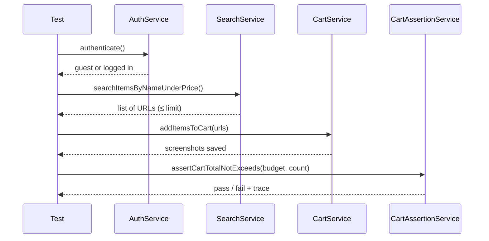

# Architecture Documentation

## Overview

The framework follows a **layered Page Object Model** architecture with clear separation of concerns:

```
┌─────────────────────────────────────────────────┐
│                  Tests Layer                     │
│         tests/test_ebay_e2e.py                  │
└────────────────────┬────────────────────────────┘
                     │
┌────────────────────▼────────────────────────────┐
│              Facade / API Layer                  │
│            ebay_automation.py                   │
└────────────────────┬────────────────────────────┘
                     │
┌────────────────────▼────────────────────────────┐
│              Services Layer                      │
│  AuthService │ SearchService │ CartService      │
│              CartAssertionService               │
└────────────────────┬────────────────────────────┘
                     │
┌────────────────────▼────────────────────────────┐
│              Pages Layer (POM)                   │
│  LoginPage │ SearchPage │ ProductPage │ CartPage│
│              BasePage (shared helpers)           │
└────────────────────┬────────────────────────────┘
                     │
┌────────────────────▼────────────────────────────┐
│              Utils Layer                         │
│  ConfigLoader │ DataLoader │ PriceParser        │
│              ScreenshotHelper                     │
└─────────────────────────────────────────────────┘
```

## Design Principles

### Single Responsibility Principle (SRP)

| Layer | Responsibility |
|-------|---------------|
| `pages/` | UI interaction and locators only |
| `services/` | Business logic and workflow orchestration |
| `utils/` | Reusable helpers (parsing, config, screenshots) |
| `tests/` | Test orchestration and assertions |
| `data/` | External test input (Data-Driven) |
| `config/` | Environment and profile configuration |

### Page Object Model (POM)

Each page class encapsulates:
- **Locators** as class constants
- **Actions** as methods (no assertions in page objects)
- **Inheritance** from `BasePage` for shared behavior

### Data-Driven Testing

Test scenarios are externalized to `data/test_scenarios.json` and `data/test_scenarios.yaml`.
The `DataLoader` reads enabled scenarios; `pytest.mark.parametrize` feeds them into tests.

### Configuration Profiles

`config/settings.yaml` defines profiles (`dev`, `ci`, `staging`) merged with `.env` overrides:

```
ENV_PROFILE=dev   → headless=false, slow_mo=100
ENV_PROFILE=ci    → headless=true, retries=1
```

## Core Workflow



## Reporting Pipeline

| Report Type | Output Path | Tool |
|-------------|-------------|------|
| Allure | `reports/allure-results/` | `allure-pytest` |
| HTML | `reports/pytest-report.html` | `pytest-html` |
| JUnit XML | `reports/junit.xml` | `pytest` built-in |
| Screenshots | `reports/screenshots/` | `ScreenshotHelper` |
| Traces | `reports/traces/` | Playwright tracing |
